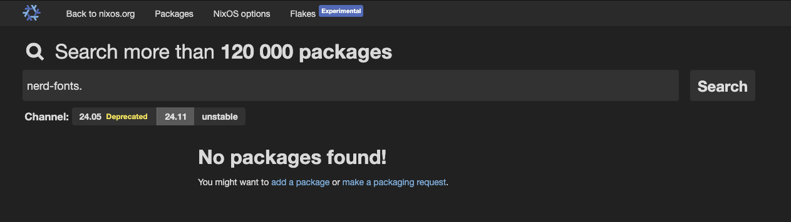
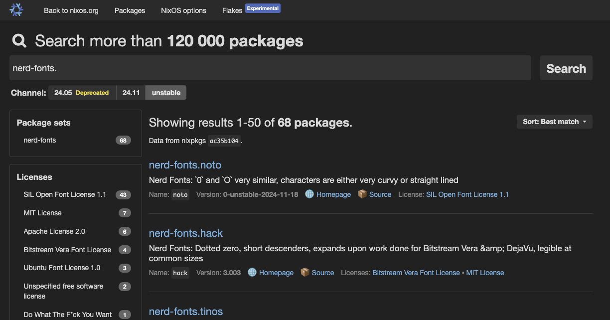

# Nix (Darwin)
This directory contains my configurations for running Nix on MacOS (`darwin`) systems.  This is made
possible via the [nix-darwin](https://github.com/LnL7/nix-darwin) modules, which wrap many of the otherwise
complicated configurations and minutia.

## Important Notes/Limitations
* The configuration set in this repo uses flakes/Nix unstable, which is subject to frequent changes and requires a little
extra TLC.
* The configuration in this repo also takes advantage of Home Manager, which isolates user profiles/configurations, compared to using system configurations.  You can find system-wide configurations in `configuration.nix` and user-specific configs in `home.nix`.  These two files (and imports contained within, which are hosted in other parallel directories in this repo) are used in tandem with Nix flakes to produce repeatable and declarative environments.
* The configuration set in this repo currently only creates a Nix config for `aarch64-darwin` (Apple Silicon)
systems, as configured in `flake.nix`:
```
nixpkgs = {
   hostPlatform = "aarch64-darwin"; # The platform the configuration will be used on.
   config = {
     allowUnfree = true; # allow unfree app installs
   };
};
```
* Several items are not yet configurable within MacOS via `nix-darwin`, including:
  * Creating/assigning custom "Login Items" (programs which should run on user login), which is useful for programs like
  Maccy, a MacOS clipboard manager, or Raycast, a better Spotlight.

## Getting Started
### Install `nix` (package manager)
1. To get started, you need to install `nix` onto your system.  You can find the download command at the
[NixOS Download Page](https://nixos.org/download/). At time of writing, the download command is as follows:
```
❯ sh <(curl -L https://nixos.org/nix/install)
```
2. Proceed with the installation as propmted.  You will need to allow the script to use `sudo` and create new volume/users.
It will take a few minutes to complete the install.
3. Once the install is completed, you can verify your nix install by running the following command:
```
❯ nix-shell -p neofetch --run neofetch
```
You should see a successful output after a few moments:
```
❯ nix-shell -p neofetch --run neofetch
                    c.'          taylorfont@amaterasu
                 ,xNMM.          --------------------
               .OMMMMo           OS: macOS 15.1.1 24B2091 arm64
               lMM"              Host: Mac16,10
     .;loddo:.  .olloddol;.      Kernel: 24.1.0
   cKMMMMMMMMMMNWMMMMMMMMMM0:    Uptime: 22 hours, 29 mins
 .KMMMMMMMMMMMMMMMMMMMMMMMWd.    Packages: 44 (brew), 348 (nix-system)
 XMMMMMMMMMMMMMMMMMMMMMMMX.      Shell: bash 5.2.37
;MMMMMMMMMMMMMMMMMMMMMMMM:       Resolution: 5120x1440
:MMMMMMMMMMMMMMMMMMMMMMMM:       DE: Aqua
.MMMMMMMMMMMMMMMMMMMMMMMMX.      WM: Quartz Compositor
 kMMMMMMMMMMMMMMMMMMMMMMMMWd.    WM Theme: Blue (Dark)
 'XMMMMMMMMMMMMMMMMMMMMMMMMMMk   Terminal: tmux
  'XMMMMMMMMMMMMMMMMMMMMMMMMK.   CPU: Apple M4
    kMMMMMMMMMMMMMMMMMMMMMMd     GPU: Apple M4
     ;KMMMMMMMWXXWMMMMMMMk.      Memory: 11862MiB / 16384MiB
       "cooc*"    "*coo'"
```
### Install `nix-darwin`
Once nix is installed, you need to install the `nix-darwin` modules. This set of steps will differ slightly from the steps listed
in the nix-darwin GitHub repository, since you have all the `*.nix` files you will need already when you clone this repo.

All we need to do is tell `nix` to rebuild our environment with the configurations defined in the `*.nix` files, which we can do using
the following command:

```
❯ nix run nix-darwin --extra-experimental-features "nix-command flake" -- switch --flake ~/nix/darwin#${FLAKE_NAME}
```

This command will take a few minutes to run the first time, but once it completes you should have the configurations applied to your environment and
`nix-darwin` modules added to your path so they are available for use.  You can confirm this by running a simple command:

```
❯ which darwin-rebuild
/run/current-system/sw/bin/darwin-rebuild
```

If this command returns a valid path, you are all set to continue using `nix` to manage your MacOS environment!  Read on to see a few extra
tips & tricks to help you operate as efficiently as possible in your new automated & decalartive environment via Nix.

## Using MacOS and `nix-darwin`
### Searching for Packages
One of the most common use cases with nix, or any declarative system, is adding or removing packages.  If you need to add a new package, you may
not be sure what the package is named, or where to find it.  Nix has one of the largest and most frequently updated package repositories in the world, `nixpkgs`,
and there are several ways to seach for a package in this repostory.

1. [RECOMMENDED] `nix repl`
* Nix (experimental versions, anwyay) ships with a command-line interface [`nix repl`](https://nix.dev/manual/nix/2.24/command-ref/new-cli/nix3-repl.html), which can be used for a number of actions, one of which is searching the `nixpkgs` library.
* This method is recommended as changes often take time to propagate into the various tools/systems, and `nix repl` allows you to interface directly with the library directly, ensuring you always have the latest changes derived, even when other GUI tools may not.
* To search for packages using `nix repl`, execute the following command:
```
❯ nix repl -f '<nixpkgs>'
```
* Once the CLI loads the library, you can search packages by name and use `Tab` to display all matches to your search string:
```
❯ nix repl -f '<nixpkgs>'
Nix 2.24.10
Type :? for help.
Loading installable ''...
Added 22960 variables.

nix-repl> nerd-fonts.
nerd-fonts._0xproto                  nerd-fonts.departure-mono            nerd-fonts.iosevka                   nerd-fonts.overrideDerivation
nerd-fonts._3270                     nerd-fonts.droid-sans-mono           nerd-fonts.iosevka-term              nerd-fonts.profont
nerd-fonts.agave                     nerd-fonts.envy-code-r               nerd-fonts.iosevka-term-slab         nerd-fonts.proggy-clean-tt
nerd-fonts.anonymice                 nerd-fonts.fantasque-sans-mono       nerd-fonts.jetbrains-mono            nerd-fonts.recurseForDerivations
nerd-fonts.arimo                     nerd-fonts.fira-code                 nerd-fonts.lekton                    nerd-fonts.recursive-mono
nerd-fonts.aurulent-sans-mono        nerd-fonts.fira-mono                 nerd-fonts.liberation                nerd-fonts.roboto-mono
nerd-fonts.bigblue-terminal          nerd-fonts.geist-mono                nerd-fonts.lilex                     nerd-fonts.sauce-code-pro
nerd-fonts.bitstream-vera-sans-mono  nerd-fonts.go-mono                   nerd-fonts.martian-mono              nerd-fonts.shure-tech-mono
nerd-fonts.blex-mono                 nerd-fonts.gohufont                  nerd-fonts.meslo-lg                  nerd-fonts.space-mono
nerd-fonts.caskaydia-cove            nerd-fonts.hack                      nerd-fonts.monaspace                 nerd-fonts.symbols-only
nerd-fonts.caskaydia-mono            nerd-fonts.hasklug                   nerd-fonts.monofur                   nerd-fonts.terminess-ttf
nerd-fonts.code-new-roman            nerd-fonts.heavy-data                nerd-fonts.monoid                    nerd-fonts.tinos
nerd-fonts.comic-shanns-mono         nerd-fonts.hurmit                    nerd-fonts.mononoki                  nerd-fonts.ubuntu
nerd-fonts.commit-mono               nerd-fonts.im-writing                nerd-fonts.mplus                     nerd-fonts.ubuntu-mono
nerd-fonts.cousine                   nerd-fonts.inconsolata               nerd-fonts.noto                      nerd-fonts.ubuntu-sans
nerd-fonts.d2coding                  nerd-fonts.inconsolata-go            nerd-fonts.open-dyslexic             nerd-fonts.victor-mono
nerd-fonts.daddy-time-mono           nerd-fonts.inconsolata-lgc           nerd-fonts.overpass                  nerd-fonts.zed-mono
nerd-fonts.dejavu-sans-mono          nerd-fonts.intone-mono               nerd-fonts.override

```
* If you wish to search a specific version of `nixpkgs`, you can clone the corresponding branch of the [`nixpkgs` repo](https://github.com/NixOS/nixpkgs) locally, then run this modified command:
```
❯ nix repl -f /path/to/local/nixpkgs/repo
```

2. NixOS Search Packages
* The `nixpkgs` library can also be searched via the index available at [search.nixos.org/packages](https://search.nixos.org/packages).
* This site provides a graphical tool to search Nix packages; however, it may not always be up-to-date, as changes are frequently being pushed (remember: this is one of the most active package libraries in the world!!!)
* An example is the `nerd-fonts` package.  It has (at time of writing) recently been refactored into a new namespace/package model.  The `nix repl` example above shows the current packages now available for use with Nix under the `nerd-fonts` namespace.  However, the NixOS Search Packages site did not return any of these packages when queried for several days.  (This has now been addressed in `unstable`, the branch this configuration set uses, but is still not in `24.11` at time of writing, as shown below)





### Temporary package install/use
If you have a package/tool that you need to use for a short time/once, you could add this to your configuration and rebuild your flake.  However,
this is a farily involved process for what amounts to a simple command/task that will likely take a few seconds to execute, if the package was
already installed.

Rather than integrate it into your flake, you can use the [`nix-shell`](https://nixos.wiki/wiki/Development_environment_with_nix-shell) feature to spin
up a temporary environment to run the commands.

For example, if you need `ffmpeg` for a quick file conversion, you could spin up a new shell with the following command:
```
nix-shell -p ffmpeg
```
* Note that you can search package names as described in the previous subsection to ensure you are creating a shell with the proper packages available.

### Upgrading packages
Most of the configuration sets in this repository are defined in such a way that they should auto-update on a rebuild of the flake.  You can always
view the currently pinned versions in the `flake.lock` file.  That said, however, there may be upgrades in the future which require a manual upgrade process.
In the event a manual upgrade is needed (perhaps to catch a new version of some package or module), you can check if there is an available upgrade for
packages via the following command:
```
❯ nix flake upgrade
```
Note this is a vanilla `nix` command, not a `nix-darwin` derivative.  Once the command above completes, it should return an output of any available upgrades.
To then apply these upgrades, simply rebuild your flake (this command also can be used to rebuild when you modify any flake configurations, not exclusively for upgrades):
```
❯ darwin-rebuild -- switch --flake ~/nix/darwin#${FLAKE_NAME}
```

